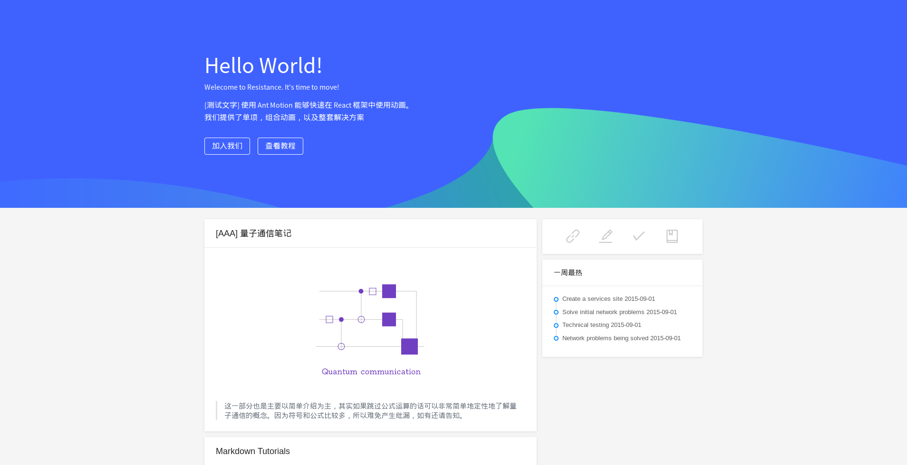
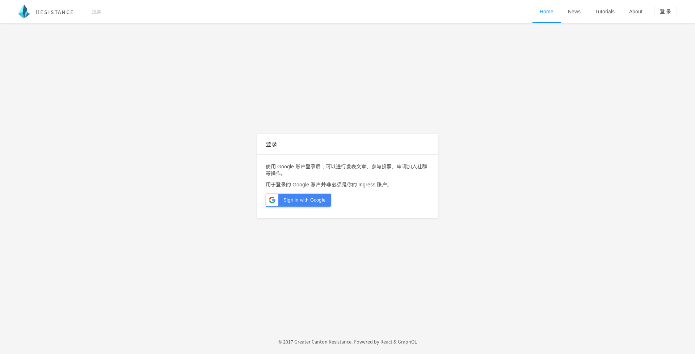
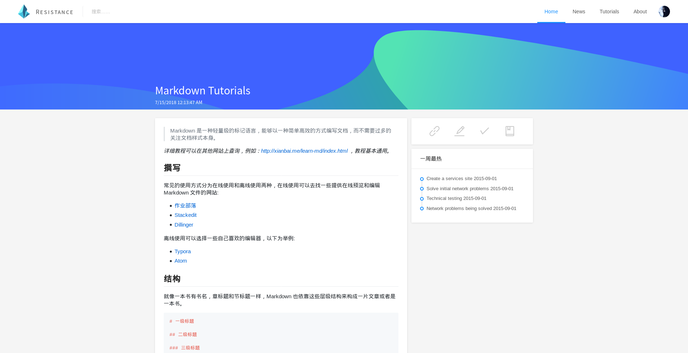
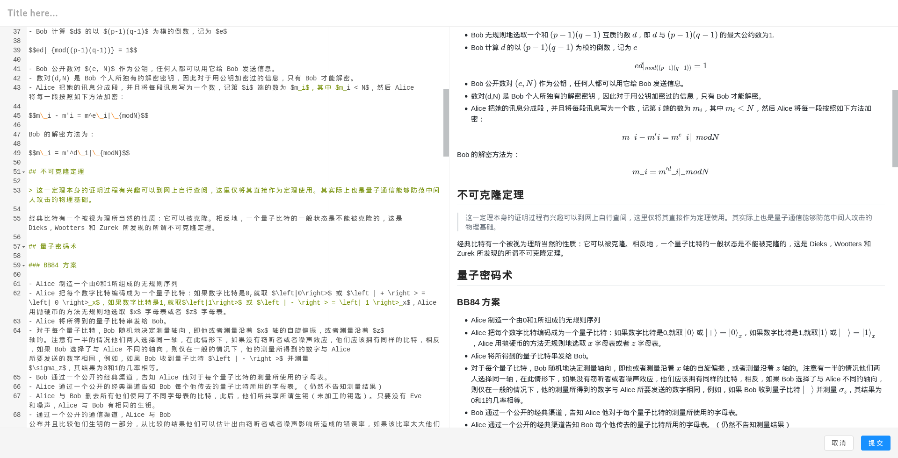
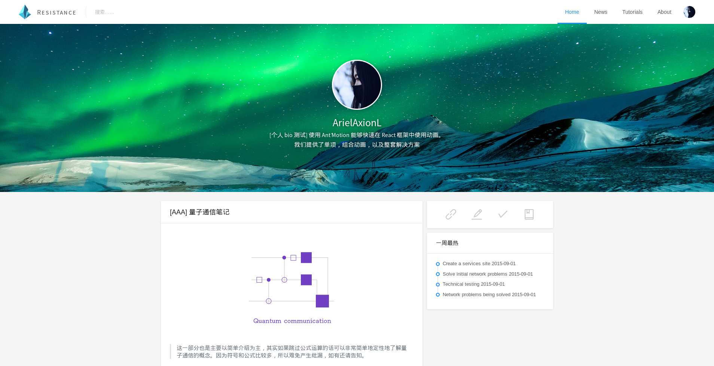
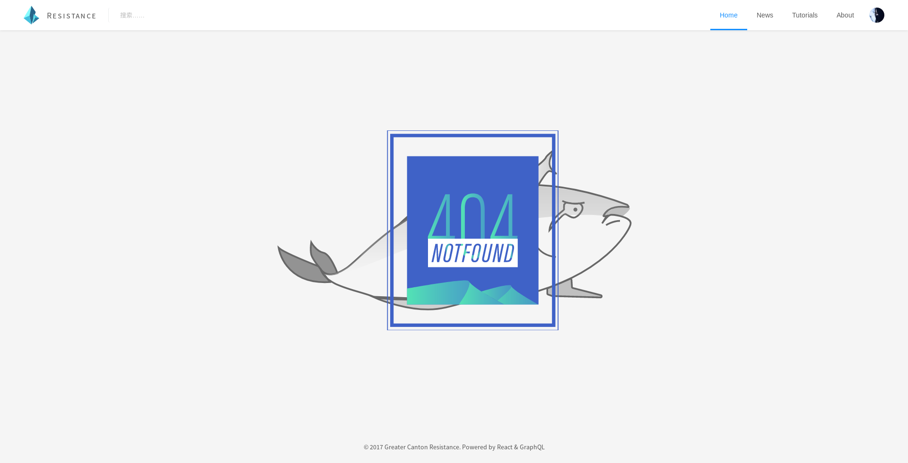
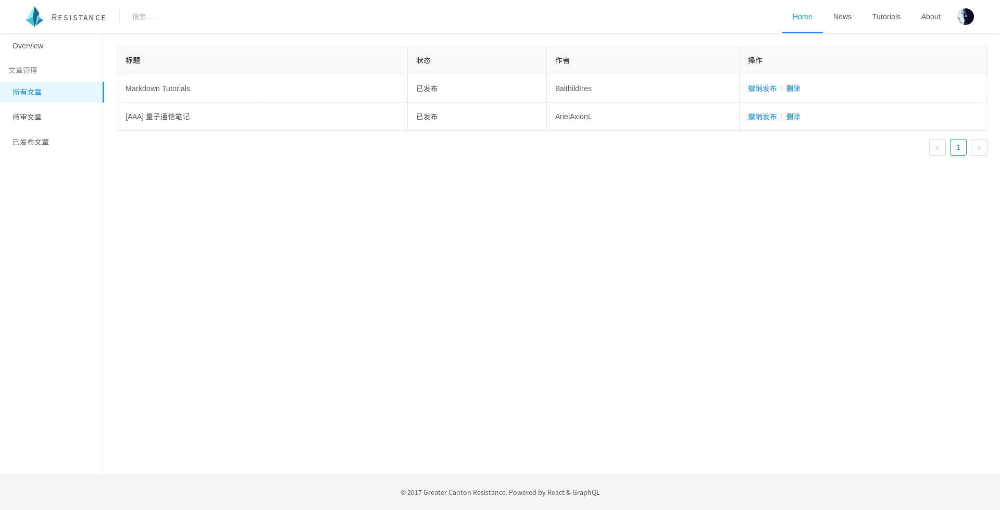

# website-react

[](https://travis-ci.org/ResistanceCN/website-react)

## Build

Install `nodejs`(>= 6) and `yarn`.

Copy `.env.example` to `.env` then edit it.

```shell
$ # git clone and cd
$ yarn install
$ yarn build
$ yarn start # default http://localhost:3000
```

## Todo List

- [ ] 表单管理和修改(Index, Google id(short), Agent name, Faction, Area, Telegram username, Marked(Group invited), Other comment, Ban, Delete）
- [ ] 个人页面和设置（Avatar(Google account avatar as default), Bio(Words Limit 256)，Connect to telegram，Account Rebind, Account destory）
- [ ] 权限管理和修改(Index, Google id(short), Telegram username, Area, Notification(Email or Telegram echo bot), Delete)
- [ ] 考虑替换地图服务
- [ ] 通知 Bot 定时请求人员信息
- [ ] （可选）disqus 评论系统（需注册填表之后才开放）
- [ ] 管理 Overview 页面显示资源统计信息
- [x] [Bug] 撤销发布之后发布状态未更新
- [x] 移除 UserMenu 中的设置组件，并重新绘制分割线
- [x] 管理员可预览源文章(raw)
- [x] [Bug] 修复 lambda in render
- [x] 检测填表状态
- [x] 压缩 404 图片
- [x] 控制台添加文章链接
- [x] 將管理員控制台面板从 userMenu 獨立出來到 panel
- [x] 更改文章編輯器發佈控件位置，以及增添取消編輯，并取消 footer
- [x] 公式块过长 （添加行内横向滚动或固定宽度，编辑器预览页面添加示宽线）

## Design

### Primary Color

RGB：#3f62ff

> [What is Ant Color style?](https://github.com/ant-design/ant-design/blob/734beb84ffc3f0469fbae1566aa8450f966cb261/components/style/color/colorPalette.less)

### Screenshots

- Home Page:
  
- Login:
  
- Article:
  
- Editor:
  
- Prifile:
  
- 404 Page:
  
- Control panel:
  
